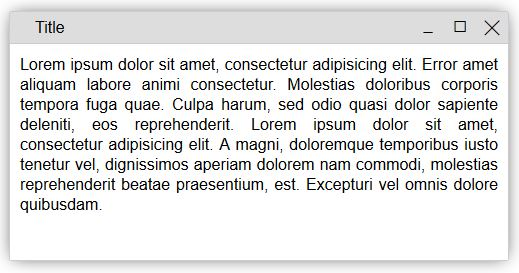

# WindowJS

WindowJS is a simple JavaScript library, to display a functional window inside of the browser.

**Demo:** https://m-thalmann.github.io/windowjs/demo/

## Navigation
- [Installation](#installation)
- [Usage](#usage)
- [Documentation](#documentation)
  - [Window](#window)
  - [WindowState](#windowstate)
  - [WindowUtil](#windowutil)
  - [Events](#events)
  - [Options](#options)
- [Example](#example)

## Installation
1. Download the .zip-File and put it in your project-folder.

2. Add this script-tag to the head of the file
```html
<script src="path/to/js/file.js"></script>
```

3. Add this link-tag to the head of the file, to include the styles
```html
<link rel="stylesheet" href="path/to/css/file.css" />
```

4. Start using the library!

## Usage
### Create new window
```javascript
var win = new Window("Awesome title");
```
**NOTE:** Don't use window as variable name, because the window object already exists!

### Add content to the window
```javascript
win.content.innerHTML = 'Lorem ipsum dolor sit amet, consectetur ...';
```
## Documentation
### Window
It's the main object to display the window
#### Instanciating
```javascript
new Window(title, options);
```
- **title** (String): This string is used as the title of the window
- **options** (object): A object with options for the window (see [below](#options)) **(optional)**

After instanciating the window is reloaded and shown (if not defined otherwise)

#### Methods
```javascript
win.reload();                        // Renders the window (you don't have to use this)

win.setTitle(title);                 // Resets the title (string)
win.getTitle();                      // Returns the current title

win.getContainer();                  // Returns the container of the window

win.changeOption(option, value);     // Changes one option (string, object)
win.getOptions();                    // Returns the options

win.changeState(state);              // Sets the current state of the window: NORMAL / MAXIMIZED  (WindowState)
win.getState();                      // Returns the current state of the window

win.changeWindowState(window_state); // Sets the current window state: SHOWN / MINIMIZED / HIDDEN (WindowState)
win.getWindowState();                // Returns the current window state

win.normalSize();                    // Normal-Sizes the window
win.isNormalSized();                 // Returns true, if the window is normal-sized, otherwise false
win.maximize();                      // Maximizes the window
win.isMaximized();                   // Returns true, if the window is maximized, otherwise false
win.toggleMaximize();                // Toggles between normal size and maximized

win.show();                          // Shows the window
win.isShown();                       // Returns true, if the window is shown, otherwise false
win.minimize();                      // Minimizes the window
win.isMinimized();                   // Returns true, if the window is minimized, otherwise false
win.hide();                          // Hides the window
win.isHidden();                      // Returns true, if the window is hidden, otherwise false
win.isVisible();                     // Returns true, if the window is not minimized and not hidden, otherwise false
win.isSelected();                    // Returns true, if the window is selected

win.getSize();                       // Returns the size of the window in pixels
win.getPosition();                   // Returns the offset position of the top left corner to the parent element

win.on(event, callback);             // Sets the eventlistener of the event, if the callback is specified;
                                     // if only the event is set, it returns the callback-function; if that is not
                                     // set, it returns a empty function (string, function)
win.removeOn(event);                 // Removes the eventlistener for the event, if set

win.reset();                         // Resets the appearence of the window (shows it and sets its size to normal)
win.close();                         // Closes the window (and disposes it, if not defined otherwise)
win.dispose();                       // Disposes the window, meaning it is removed from the dom (can be re-created
                                     // with win.reload())
```
#### Variables
```javascript
Window.count                         // static integer, that contains the number of instanciated windows so far

Window.DISPOSE_ON_CLOSE              // static variable, to set the close action (disposes the window)
Window.HIDE_ON_CLOSE                 // static variable, to set the close action (only hides the window)
Window.DO_NOTHING_ON_CLOSE           // static variable, to set the close action (doesn't hide the window)

Window.DOUBLE_CLICK_DELAY            // static int, that determins how many ms the user have for the double
                                     // click (default: 300)

win.content                          // DOM-Object, that represents the content of the window (edit this!)
```

### WindowState
A collection of states, a window can have. Can't be instanciated.
#### Variables
```javascript
WindowState.NORMAL
WindowState.MAXIMIZED
WindowState.MINIMIZED
WindowState.SHOWN
WindowState.HIDDE
```

### WindowUtil
A collection of methods. Can't be instanciated.
#### Methods
```javascript
WindowUtil.getProperty(opt, o, def); // Returns the value of 'o' in the array/object opt, if it is set;
                                     // else it returns def (object, string, object)
```

### Events
It is possible to attach a event to a window: ``window.on(event, callback);``

| Event | Callback-Parameter(s) | Definition |
|:-------------------:|:------------------------------------:|:--------------------------------------------------------------------------------------------------------:|
| change_title | {old_title, new_title} | Is triggered, when the title is changed |
| reload | - | Is triggered, when the reload function is invoked |
| resize_start | e[MouseDownEvent] | Is triggered, when one resize-handle is clicked |
| resize_stop | e[MouseUpEvent] | Is triggered, when the resize-handle is released |
| resize | e[MouseMoveEvent] | Is triggered, when the window is resized |
| move_start | e[MouseDownEvent] | Is triggered, when the top bar is clicked once |
| move_stop | e[MouseUpEvent] | Is triggered, when the top bar is released |
| move | e[MouseMoveEvent] | Is triggered, when the window is moved |
| change_state | {old_state, new_state} | Is triggered, when the state is changed |
| change_window_state | {old_window_state, new_window_state} | Is triggered, when the window state is changed |
| update_size | {old_size, new_size} | Is triggered, when the window size changes |
| update_selected | - | Is triggered, when the window selection changes |
| select | - | Is triggered, when the window is selected |
| deselect | - | Is triggered, when the window is deselected |
| minimize | - | Is triggered, when the window is minimized |
| normalSize | - | Is triggered, when the window is normal-sized |
| maximize | - | Is triggered, when the window is maximized |
| hide | - | Is triggered, when the window is hidden |
| show | - | Is triggered, when the window is shown |
| update_position | {old_position, new_position} | Is triggered, when the window position changes |
| reset | - | Is triggered, when the reset function is invoked |
| closing | - | Is triggered, before the window is closed; if the callback return false, the window is not closed |
| closed | - | Is triggered, when the window is closed |
| disposing | - | Is triggered, before the window is disposing; if the callback return false, the window is not disposed |
| disposed | - | Is triggered, when the window is disposed |
| init | - | Is triggered, when the window is initialized for the first time |
| maximizing | - | Is triggered, before the window is maximized; if the callback returns false, the window is not maximized |
| minimizing | - | Is triggered, before the window is minimized; if the callback return false, the window is not minimized |

### Options
| Option | Values | Definition |
|:---------------:|:-----------------------------------------------------------------------:|:--------------------------------------------------------------------------------------:|
| icon | [string] | Sets the icon of the window (top-left) |
| minimize_icon | [string] | Sets the minimize icon |
| maximize_icon | [string] | Sets the icon, that is displayed, when the window is not maximized |
| normalsize_icon | [string] | Sets the icon, that is displayed, when the window is maximized |
| close_icon | [string] | Sets the close icon |
| size | {width: [int], height: [int]} | Sets the size of the window (**def:** {width: 200, height: 150}) |
| position | {x: [int], y: [int]} | Sets the position, relative to the parent (**def:** center of the parent) |
| selected | true/false | Defines, whether it is selected or not (styled differently) (**def:** false) |
| min_size | {width: [int], height: [int]} | Sets the minimum size, the window can have (**def:** {width: 200, height: 150}) |
| max_size | {width: [int], height: [int]} | Sets the maximum size, the window can have (**def:** {}) |
| events | {[string]: [function], [...]} | Sets the events for the window (if a event is set before, it gets overwritten) |
| bar_visible | true/false | Defines, whether the top bar (with title, ...) is visible or not (**def:** true) |
| resizable | true/false | Defines, whether the window is resizable or not (**def:** true) |
| movable | true/false | Defines, whether the window is movable or not (**def:** true) |
| maximizable | true/false | Defines, whether the window is maximizable or not (**def:** true) |
| minimizable | true/false | Defines, whether the window is minimizable or not (**def:** true) |
| always_on_top | true/false | Sets, if the window is always in front of the other windows (**def:** false) |
| container | [DOM-Object] | If this is set, the parent of the window is set to that (**def:** document.body) |
| window_state | [WindowState] | Sets the state of the window: SHOWN, MINIMIZED, HIDDEN (**def:** SHOWN) |
| close_action | Window.DISPOSE_ON_CLOSE Window.HIDE_ON_CLOSE Window.DO_NOTHING_ON_CLOSE | Defines, what happens, when the window is beeing closed (**def:** Window.DISPOSE_ON_CLOSE) |

## Example
### Code:
```javascript
var win = new Window("Title", {
  state: WindowState.NORMAL,
  size: {
    width: 500,
    height: 250
  },
  selected: true,
});
win.content.style.padding = "5px";
win.content.style.textAlign = "justify";
win.content.innerHTML = 'Lorem ipsum dolor sit amet, [...]';
```

### Output:


